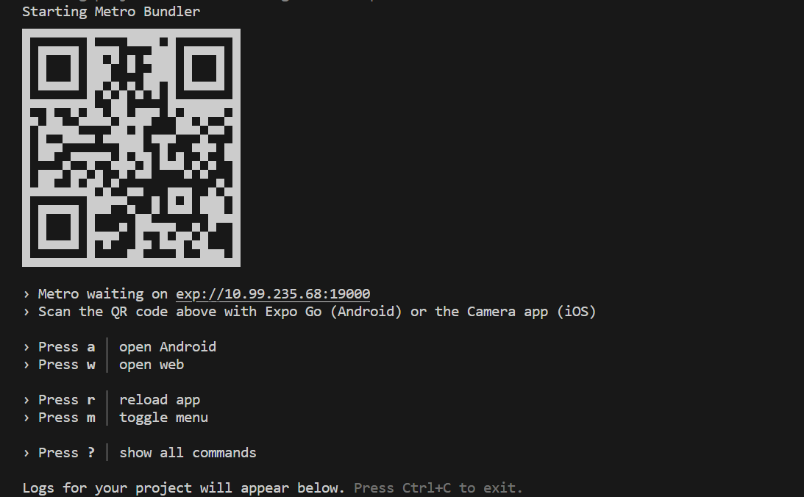

# Health Tracker App

## React Native Project Setup Guide (For windows):
> This guide will walk you through setting up a React Native project on your development environment.

### Prerequisites
Before you begin, ensure you have the following software installed:

* [Java Development Kit (JDK 21)] (https://www.oracle.com/in/java/technologies/downloads)
* [Android Studio with Android Virtual Device (AVD) Manager] (https://developer.android.com/studio) 
* [Node.js (any version >13)] (https://nodejs.org/en/download)
* [Visual Studio Code (or any other preferred code editor)] (https://code.visualstudio.com/)

### Steps to Set Up

1. Install JDK
Download and install the latest version of JDK from the official website: Oracle JDK

Add JDK to your system PATH.

2. Install Android Studio
Download and install Android Studio from the official website: Android Studio

Launch Android Studio and install the necessary SDK components through the SDK Manager. Also, create a virtual device using the AVD Manager.

3. Install Node.js
Download and install Node.js from the official website: Node.js

4. Install Expo CLI
Run the following command in your terminal to install Expo CLI globally:

```npm install -g expo-cli```

5. Clone the Project Repository
Clone the React Native project repository from GitHub:

git clone <repository_url>

6. Open Project in Visual Studio Code
Navigate to the project directory and open it in Visual Studio Code or any other preferred code editor.

7. Install Dependencies
In the terminal, run the following command to install project dependencies:

```npm install```

9. Set Up Android SDK Path
Add the Android SDK platform-tools directory to your system PATH. Typically, it's located at:

C:\Users\<username>\AppData\Local\Android\Sdk\platform-tools

10. Start Development
To run the project on an Android device or emulator, run the following command:

```npm run android```
> [!TIP]
> To run in expo, ```expo start``` .



## React Native Project Setup Guide (For Ubuntu):

> This guide will walk you through setting up a React Native project on your development environment.

### Prerequisites
Before you begin, ensure you have the following software installed:

* [Java Development Kit (JDK 21)] (https://www.oracle.com/in/java/technologies/downloads)
* [Android Studio with Android Virtual Device (AVD) Manager] (https://developer.android.com/studio) 
* [Node.js (any version >13)] (https://nodejs.org/en/download)
* [Visual Studio Code (or any other preferred code editor)] (https://code.visualstudio.com/)

#### Steps to Set Up

1. Install JDK
Download and install the latest version of JDK from the official website: Oracle JDK

Add JDK to your system PATH.

2. Install Android Studio
Download and install Android Studio from the official website: Android Studio

Launch Android Studio and install the necessary SDK components through the SDK Manager. Also, create a virtual device using the AVD Manager.

3. Install Node.js
Download and install Node.js from the official website: Node.js

4. Install Expo CLI
Run the following command in your terminal to install Expo CLI globally:

```npm install -g expo-cli```

5. Clone the Project Repository
Clone the React Native project repository from GitHub:

git clone <repository_url>

6. Open Project in Visual Studio Code
Navigate to the project directory and open it in Visual Studio Code or any other preferred code editor.

7. Install Dependencies
In the terminal, run the following command to install project dependencies:

```npm install```

9. Set Up Android SDK Path
Add the Android SDK platform-tools directory to your system PATH. Typically, it's located at:

/home/<username>/Android/Sdk/platform-tools

10. Start Development
To run the project on an Android device or emulator, run the following command:

```npm run android```
> [!TIP]
> To run in expo, ```expo start``` .


